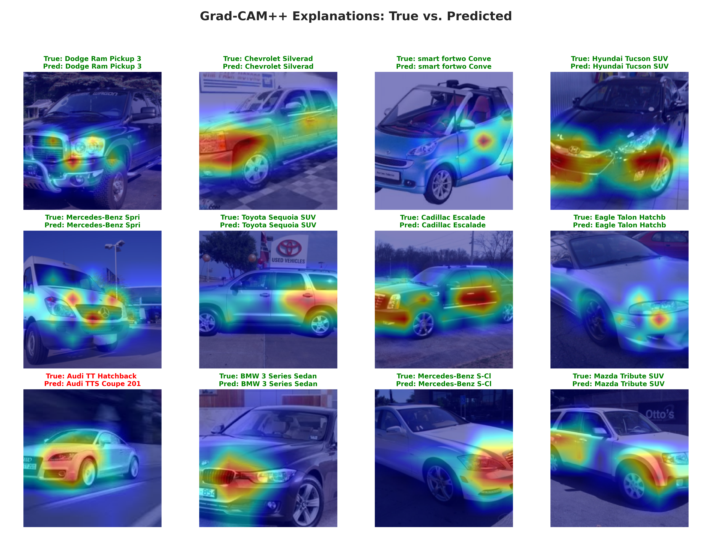
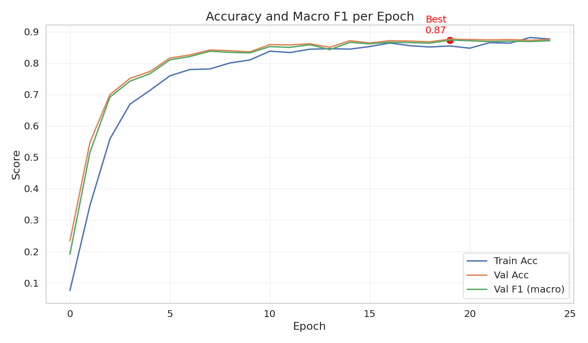
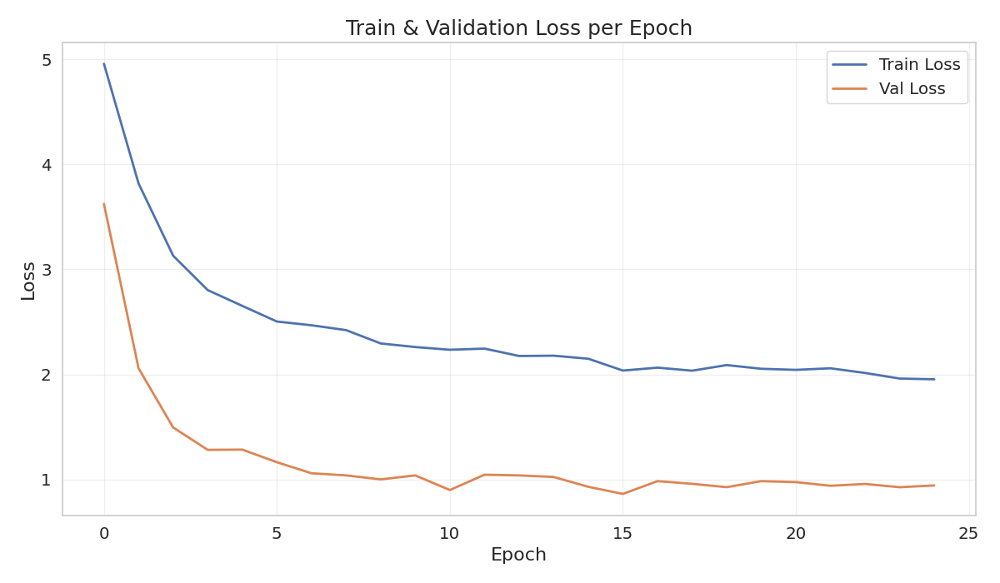
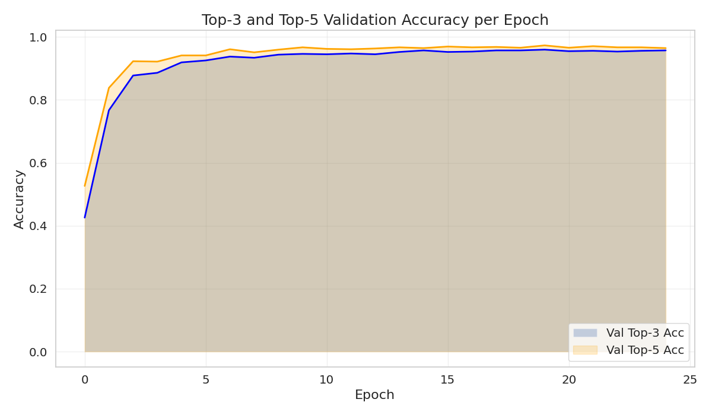
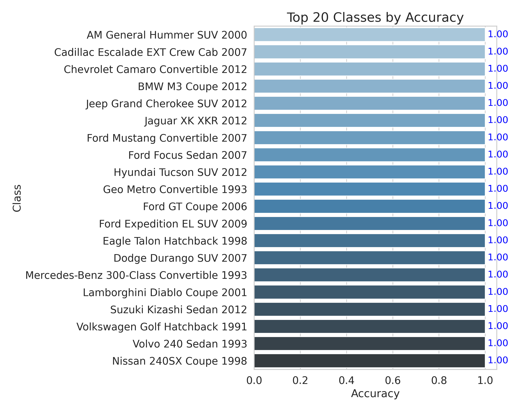
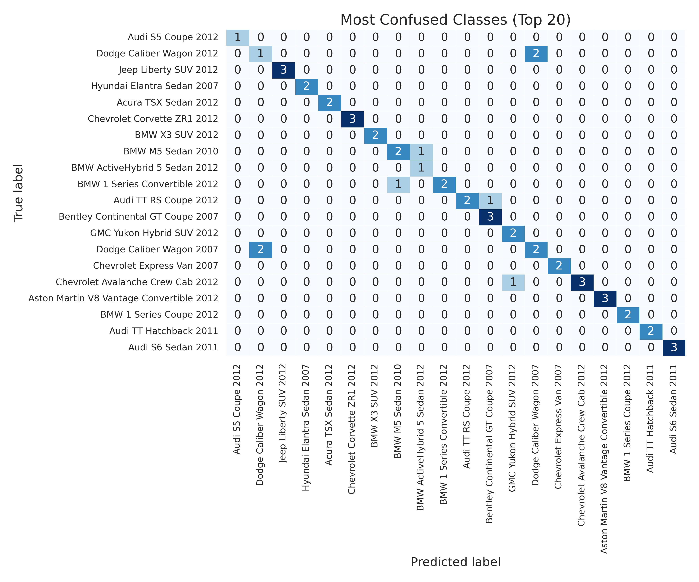
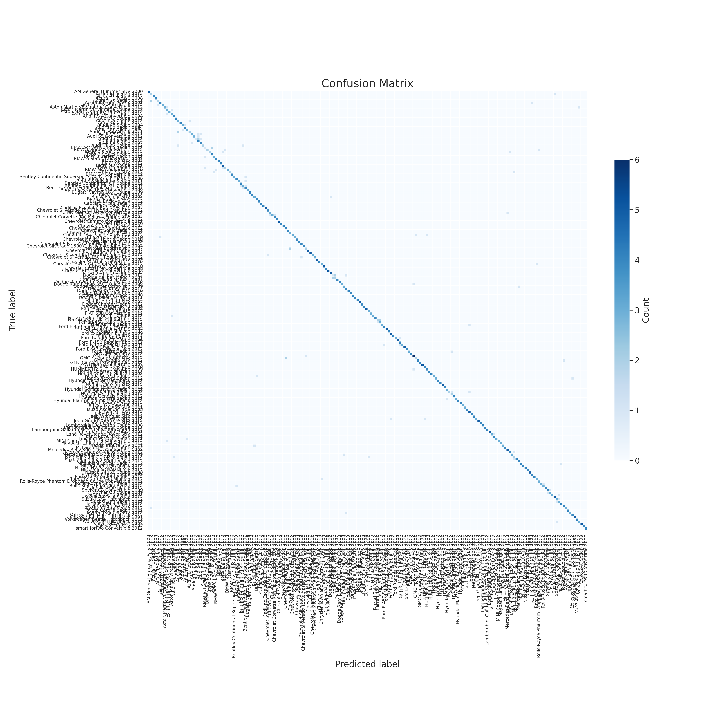

# 🚗 TwinCar: Fine-Grained Car Classification on Stanford Cars 196 (EfficientNetV2 Edition)

> **TwinCar** is a modern deep learning pipeline for car make/model/year classification, featuring a cutting-edge EfficientNetV2 backbone, advanced data augmentation (Mixup, CutMix), robust metric tracking, rich evaluation visuals, and deep model explainability (Grad-CAM++).  
Developed for the Brainster Data Science Academy, 2025.

---
<details> <summary><strong>📂 Project Directory Structure</strong></summary>
CarClassificationTeam3/
├── models/              # Saved model weights/checkpoints
├── notebook/
│   └── Last_model.ipynb # Final training & evaluation notebook
├── reports/             # Reports, results, and documentation
├── twincar/             # Main package source code
├── config.py            # Configuration settings
├── dataset.py           # Dataset loading & preprocessing
├── README.md            # Project documentation (this file)
├── modeling/            # Model definitions and utilities
├── train.py             # Model training script
├── predict.py           # Inference script
├── gradcampp.py         # Grad-CAM++ explainability script
├── last_model.py        # Final model pipeline
├── requirements.txt     # Dependencies
</details>

## Table of Contents

- [Overview](#overview)
- [Project Structure](#project-structure)
- [Dataset & Preprocessing](#dataset--preprocessing)
- [Model Architecture](#model-architecture)
- [Training Pipeline](#training-pipeline)
- [Grad-CAM++ Explainability](#grad-cam-explainability)
- [Visualizations](#visualizations)
- [Metrics & Results](#metrics--results)
- [Hugging Face & Demo](#hugging-face--demo)
- [Usage & Inference](#usage--inference)

---

## Overview

TwinCar tackles **fine-grained car recognition**: distinguishing between 196 car makes, models, and years, with minimal visual differences.

**Key features:**
- **EfficientNetV2** backbone (pretrained, SOTA accuracy and speed)
- Advanced augmentations: Mixup, CutMix, strong color/blur transforms
- Weighted random sampling for class balance
- Complete metric logging (accuracy, F1, precision, recall, Top-3/Top-5, confusion matrix)
- **Grad-CAM++** explainability, per-sample and grid
- **Test-Time Augmentation** (TTA) for robust evaluation
- Fully reproducible and scriptable end-to-end

---

## Dataset & Preprocessing

- **Dataset:** [Stanford Cars 196](https://huggingface.co/datasets/tanganke/stanford_cars)
    - 196 classes, 16,185 images (train/test)
    - Each image labeled by make/model/year
    - Full human-readable metadata (`cars_meta.mat`)
- **Preprocessing:**
    - Annotations extracted to CSV
    - Stratified train/val split (10% validation)
    - Outlier and missing image checks
    - **Advanced augmentations**: random resized crop, flip, rotation, color jitter, blur, Mixup/CutMix
    - Per-channel normalization (ImageNet stats)

---

## Model Architecture

- **Backbone:** `EfficientNetV2` (pretrained on ImageNet21k, all layers trainable)
- **Classifier Head:**  
    - Linear(embedding_size → 512) → ReLU → Dropout(0.2) → Linear(512 → 196)
- **Optimization:**
    - AdamW optimizer (one of the most robust for deep learning)
    - Cross-Entropy loss with optional label smoothing for regularization
- **Callbacks:**
    - Early stopping (patience=7 epochs, on macro F1)
    - ReduceLROnPlateau (automatic learning rate schedule)
    - WeightedRandomSampler for class balance
    - Full support for GPU or CPU

**Diagram:**  
Input Image → [Augmentation: Mixup/CutMix, crop, jitter, blur]  
→ EfficientNetV2  
→ Custom Classifier Head  
→ 196-class Softmax

---

## Training Pipeline

- **Epochs:** Up to 25 (with early stopping)
- **Batch Size:** 32 (weighted for class balance, even for Mixup/CutMix)
- **Validation:** Macro/micro metrics, confusion matrices, Top-3/Top-5 accuracy
- **Logging:** All key metrics saved (CSV), plus visual curves for:
    - Accuracy & F1 per epoch
    - Precision/Recall (macro/weighted)
    - Loss curves
    - Top-3/Top-5 accuracy curves
- **Artifacts:** All reports, CSVs, and plots saved for reproducibility

**Typical training logic:**  
- Train with strong augmentations & balanced sampling  
- Monitor macro-F1 on validation set; trigger early stopping if no improvement  
- Save the best model automatically

---

## Grad-CAM++ Explainability

**What is Grad-CAM++?**  
Grad-CAM++ is an advanced visualization tool that highlights regions in an input image that are most influential for a model’s prediction.
- **Why use it?**
    - Helps understand _why_ the model predicts a certain class (e.g., “is it focusing on the headlights or the logo?”)
    - Builds trust for deployment and debugging
- **How it's used:**
    - For each prediction, Grad-CAM++ generates a heatmap overlay showing which pixels most affected the result.

**Example (Grid):**  


*Selected Grad-CAM++ overlays for validation samples:  
Green titles = correct prediction, Red titles = wrong prediction.*

---
## Visualizations

Below are key visual outputs from the model training and evaluation.  
*All files are in the [`/reports`](./reports) directory.*

<table>
  <tr>
    <td>
      <br>
      <b>Accuracy & Macro F1</b>
    </td>
    <td>
      <br>
      <b>Loss Curve</b>
    </td>
  </tr>
  <tr>
    <td>
      <br>
      <b>Precision & Recall</b>
    </td>
    <td>
      <br>
      <b>Top-3/Top-5 Accuracy</b>
    </td>
  </tr>
  <tr>
    <td colspan="2" align="center">
      <br>
      <b>Top-20 Accurate Classes</b>
    </td>
  </tr>
</table>

---

### 🔍 Advanced Evaluation

<table>
  <tr>
    <td>
      <br>
      <b>Top-20 Most Confused Classes</b>
    </td>
    <td>
      <br>
      <b>Full Confusion Matrix</b>
    </td>
  </tr>
</table>

---

## Metrics & Results

| Metric                 | Value (example) |
|------------------------|--------|
| train_loss             | 0.97   |
| train_acc              | 0.997  |
| val_loss               | 1.40   |
| val_acc                | 0.87   |
| val_precision_macro    | 0.88   |
| val_precision_weighted | 0.89   |
| val_recall_macro       | 0.87   |
| val_recall_weighted    | 0.87   |
| val_f1_macro           | 0.87   |
| val_f1_weighted        | 0.88   |
| val_top3               | 0.95   |
| val_top5               | 0.97   |

---

##  Hugging Face & Demo
[Click here to view the model on Hugging Face](https://huggingface.co/kikogazda/Efficient_NetV2_Edition)

[Click here to launch the demo](https://kikogazda-efficient-netv2.hf.space/)

---

## ⬇️ Download Resources

- **Stanford Cars 196 Dataset:**  
  [Download directly from Stanford](https://huggingface.co/datasets/tanganke/stanford_cars)
- **Trained Model Weights:**  
  (https://huggingface.co/kikogazda/Efficient_NetV2_Edition/blob/main/efficientnetv2_best_model.pth)
  
## Usage & Inference

```python

import torch
import timm
from torchvision import transforms
from PIL import Image
import scipy.io
import os

# Set dataset and model paths
EXTRACTED_ROOT = "stanford_cars"  # Change if you extracted elsewhere
META_PATH = os.path.join(EXTRACTED_ROOT, "car_devkit", "devkit", "cars_meta.mat")
MODEL_PATH = "models/efficientnetv2_best_model.pth"

# Load class names directly from Stanford Cars dataset
meta = scipy.io.loadmat(META_PATH)
class_names = [x[0] for x in meta['class_names'][0]]

# Model setup
NUM_CLASSES = len(class_names)
device = torch.device("cuda" if torch.cuda.is_available() else "cpu")
model = timm.create_model('efficientnetv2_rw_s', pretrained=False, num_classes=NUM_CLASSES)
model.load_state_dict(torch.load(MODEL_PATH, map_location=device))
model.eval()
model.to(device)

# Preprocessing (matches validation)
imagenet_mean = [0.485, 0.456, 0.406]
imagenet_std = [0.229, 0.224, 0.225]
transform = transforms.Compose([
    transforms.Resize(256),
    transforms.CenterCrop(224),
    transforms.ToTensor(),
    transforms.Normalize(mean=imagenet_mean, std=imagenet_std)
])

# Load and preprocess image
img = Image.open("your_image.jpg").convert("RGB")
input_tensor = transform(img).unsqueeze(0).to(device)

# Predict
with torch.no_grad():
    output = model(input_tensor)
    pred_idx = output.argmax(1).item()

print(f"Predicted class: {class_names[pred_idx]} (index: {pred_idx})")
