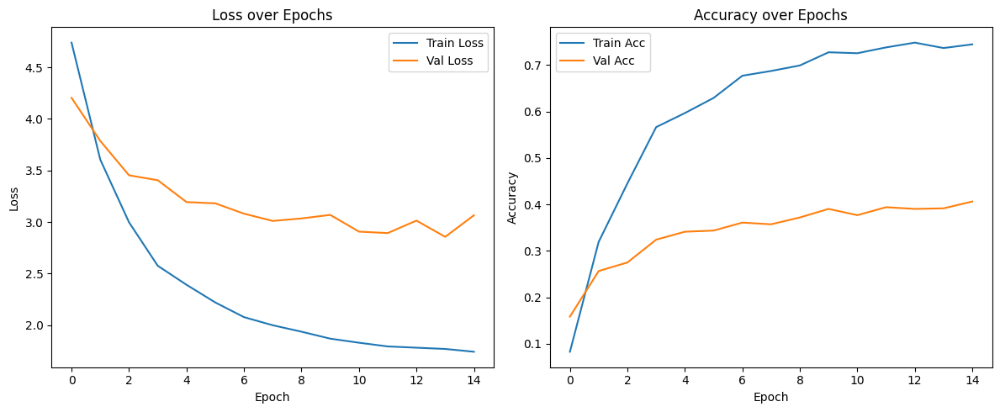
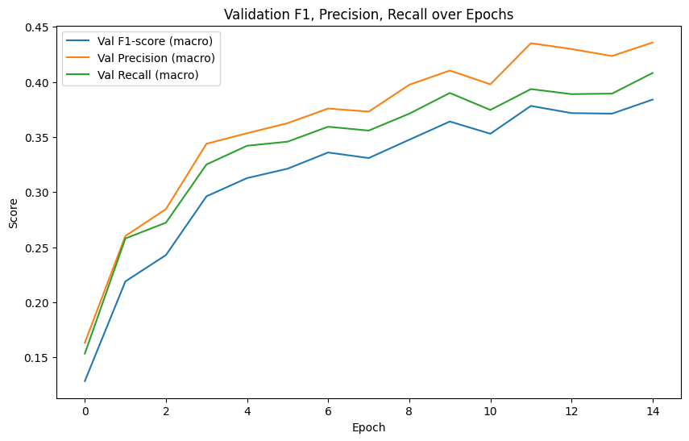
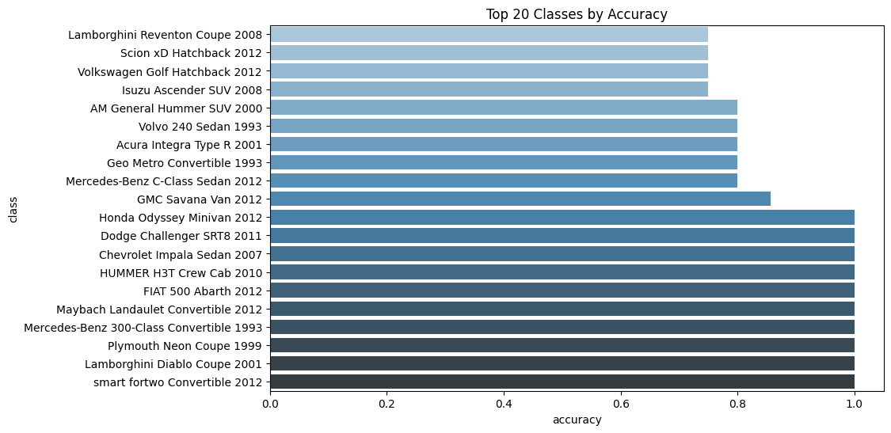
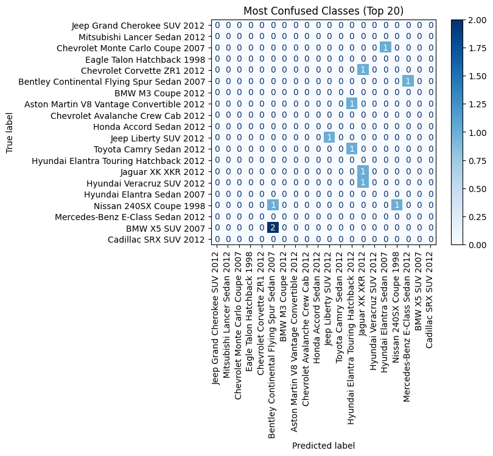
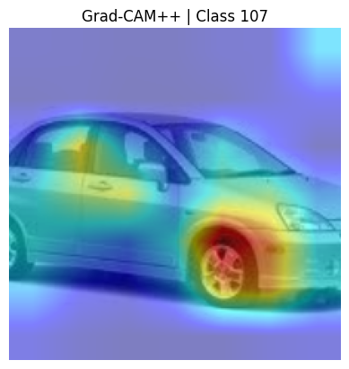
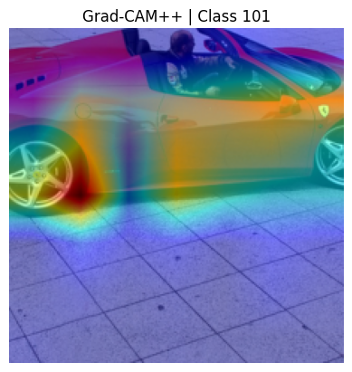
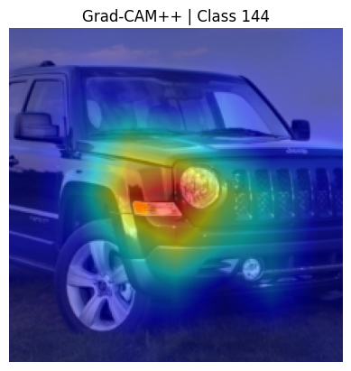
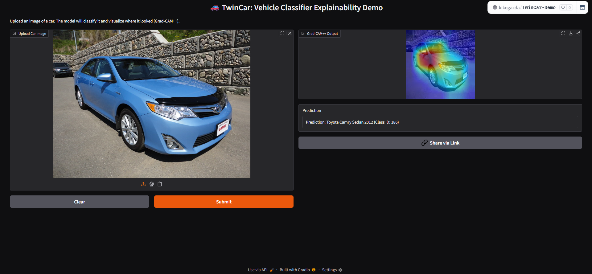

# 🚗 TwinCar: Fine-Grained Car Classification on Stanford Cars 196

## Overview

TwinCar is an end-to-end deep learning pipeline for fine-grained car make and model classification using the [Stanford Cars 196 dataset](https://huggingface.co/datasets/tanganke/stanford_cars).
Our approach leverages transfer learning with ResNet50, strong data augmentation, robust metric tracking, explainability (Grad-CAM++), and fully reproducible code in Google Colab.
The project was developed as part of the Brainster Data Science Academy 2025.

```
📦 CarClassificationTeam3/
├── 📁 models/
│   └── 📄 Model Weights.txt
├── 📁 notebooks/
│   └── 📒 Brainster_Project_Team3.ipynb
├── 📁 reports/
│   ├── 🟩 classification_matrix.png
│   ├── 📊 classification_report.csv
│   ├── 🖼️ gradcam_campp01.png
│   ├── 🖼️ gradcam_campp02.png
│   ├── 🖼️ gradcam_campp03.png
│   ├── 🖼️ gradcam_campp04.png
│   └── 🖼️ gradcam_campp_00.png
├── 🏷️ test_labels.csv
├── 🏷️ test_predictions_named.csv
├── 📈 top20_accuracy.png
├── 📉 top20_confused.png
├── 🗂️ train_split.csv
├── 📈 train_val_curves.png
├── 📉 val_f1_prec_recall_curves.png
├── 🗂️ val_split.csv
├── 🖼️ demo_screenshot.png
├── 📁 twincar/
│   ├── 📝 __init__.py
│   ├── ⚙️ config.py
│   ├── 🗃️ dataset.py
│   ├── 🧩 features.py
│   ├── 📁 modeling/
│   │   ├── 📝 __init__.py
│   │   ├── 🚂 train.py
│   │   ├── 🤖 predict.py
│   │   └── 🔍 gradcampp.py
│   └── 📊 plots.py
├── 🧠 brainster.py
├── 📄 requirements.txt
└── 📝 README.md
```

## 📑 Table of Contents

- [Overview](#overview)
- [Dataset & Preprocessing](#dataset--preprocessing)
- [Model Architecture](#model-architecture)
- [Training Procedure](#training-procedure)
- [Metrics & Results](#metrics--results)
- [Visualizations](#visualizations)
- [Explainability](#explainability)
- [Download](#download)
- [Usage & Inference](#usage--inference)

## Dataset & Preprocessing

- **Dataset:** Stanford Cars 196
- **Download:** [Google Drive link (Stanford Cars 196, ready-to-use)](https://drive.google.com/file/d/1ndQZ75d6iWW7sfSriv6PizM1RT5MRgh_/view?usp=drivesdk)
- **Classes:** 196 distinct car make/model categories
- **Images:** 16,185 (8,144 train, 8,041 test)
- **Annotations:** .mat files with bounding boxes and labels
- **Steps:**
    - Extracted and verified all images
    - Converted annotations to CSV for PyTorch compatibility
    - Checked for and handled missing/corrupted files
    - Stratified train/val/test split (90/10 on train for validation)
    - Data augmentation: random resized crop, horizontal flip, random rotation, normalization
    - Test set processed for inference only (no augmentation)


## Model Architecture

- **Base Model:** ResNet50 pretrained on ImageNet
- **Transfer Learning:** All convolutional layers frozen
- **Custom Head:**
    - Linear layer (ResNet output → 128)
    - ReLU activation
    - Dropout (p=0.2)
    - Linear layer (128 → 196, one per class)
- **Loss:** CrossEntropyLoss
- **Optimizer:** Adam
- **Scheduler:** (Optional) StepLR or ReduceLROnPlateau (not required for baseline)
- **Class Imbalance:** No oversampling needed (dataset is mostly balanced), but macro-averaged metrics reported

## Training Procedure

- **Epochs:** 15 (early stopping if overfitting detected)
- **Batch Size:** 32 (can be adjusted)
- **Augmentation:** Strong on training set for better generalization
- **Metrics Tracked:** Accuracy, F1, Precision, Recall (macro and per-class)
- **Validation:** Metrics and losses logged each epoch
- **Reproducibility:** Random seeds set for splits and PyTorch training

---
## Metrics & Results

| **Metric**          | **Value** | **Description**                                          |
|---------------------|-----------|----------------------------------------------------------|
| Validation Accuracy | 40.6%     | Correct predictions on the validation dataset            |
| Training Accuracy   | 74.4%     | Correct predictions on the training dataset              |
| Validation Loss     | 3.07      | Cross-entropy loss on validation set                     |
| Training Loss       | 1.74      | Cross-entropy loss on training set                       |
| Macro F1-score      | 0.38      | Harmonic mean of precision and recall across all classes |
| Macro Precision     | 0.44      | Average precision over all classes                       |
| Macro Recall        | 0.41      | Average recall over all classes                          |

---

## Visualizations

| Plot/Result                     | File                          | Description                                        |
|--------------------------------|-------------------------------|----------------------------------------------------|
| Loss and Accuracy Curves       | `train_val_curves.png`        | Shows model convergence and training vs. validation gap |
| F1/Precision/Recall Curves     | `val_f1_prec_recall_curves.png` | Macro metrics tracking over epochs                  |
| Confusion Matrix (validation)  | `classification_matrix.png`   | 196x196 confusion matrix (see Top-20 for clarity)  |
| Top-20 by Accuracy             | `top20_accuracy.png`          | Best-performing classes by individual accuracy     |
| Top-20 Most Confused Classes   | `top20_confused.png`          | Most frequently misclassified class pairs          |
| Grad-CAM++ Examples            | `gradcam_campp_00.png`, ...   | Visual explanation of model attention              |

> 🔄 *Note:* These visualizations were regenerated from the latest training run using updated `brainster.py`. Minor metric or shape variations are expected but don't impact overall trends.

### 🔍 Visual Samples

**Loss and Accuracy Curves**  


**F1 / Precision / Recall Curves**  


**Confusion Matrix**  


**Top-20 by Accuracy**  


**Top-20 Most Confused Classes**  


---

**Confusion Matrix:**  
Due to 196 classes, axis labels are compressed; use Top-20 plots for interpretability.

**Test Predictions:**  
- Test predictions (`test_predictions_named.csv`) saved for submission—no labels available, so no test metrics are plotted.

**Per-Class Metrics:**  
- See `classification_report.csv` for precision, recall, F1 per class.

##  Explainability

To interpret the model's predictions, we use **Grad-CAM++**, a visualization technique that highlights which regions of the input image the model relies on when making decisions.

These heatmaps reveal which visual features (e.g., grilles, lights, wheels) influenced the prediction most — helping us assess if the model focuses on the right areas or gets distracted by irrelevant details.

You can explore a full set of Grad-CAM++ results in the `reports/` directory.

---

### 🖼️ Example 1: Grad-CAM++ – Class 178
  
*Focuses on headlights, hood, and wheel area for vehicle recognition.*


### 🖼️ Example 2: Grad-CAM++ – Class 042
  
*Heatmap highlights rear body and tire — strong indicators of class features.*


### 🖼️ Example 3: Grad-CAM++ – Class 087
  
*Attention concentrated on windshield and grille, where brand design cues often appear.*

---
## Model Card

The official Hugging Face model card for this project (including model details, evaluation metrics, and usage instructions) is available here:

👉 [View TwinCar-196 Model Card on Hugging Face](https://huggingface.co/kikogazda/TwinCar-196)

# TwinCar: Fine-Grained Car Classification on Stanford Cars 196

## 🚀 Try It Online
You can test the model online (no setup required) by uploading an image of a car:
👉 [TwinCar Demo on Hugging Face Spaces](https://kikogazda-twincar-demo.hf.space/?logs=container&__theme=system&deep_link=oy0lwFp71xg)

## How to Use:
- Upload an image of a car.
- Click "Submit" to get the predicted model class.
- See the output with the predicted car make/model.

## Example:



## Requirements

This project was developed and tested with the following Python packages:

torch

torchvision

pandas

numpy

matplotlib

scikit-learn

Pillow

scipy

tqdm

gradio

opencv-python    # (if using Grad-CAM++ visualization)

All required packages are listed in requirements.txt for easy installation:
pip install -r requirements.txt

---

### Download
[Google Drive link (Stanford Cars 196, ready-to-use)](https://drive.google.com/file/d/1jaxOSP9iv3nfFjgwBaqd9gJ4VwMLR91q/view?usp=sharing)  
**Where to extract:** After download, extract the dataset to the `data/` folder in the root directory.  
**Access issues?** If you cannot access the Google Drive, you can download from:
  - [Stanford Cars official site](http://ai.stanford.edu/~jkrause/cars/car_dataset.html)
  - [Stanford Cars on Hugging Face](https://huggingface.co/datasets/tanganke/stanford_cars)

**Trained Model Weights:**  
If you need the fine-tuned `resnet50_finetuned.pth` weights for inference, download them from Hugging Face:

- [Download from Hugging Face](https://huggingface.co/kikogazda/TwinCar-196/resolve/main/resnet50_finetuned.pth)

Place the downloaded file inside the `models/` folder:

```
project_root/
└── models/
    └── resnet50_finetuned.pth
```

## Usage & Inference

To load the trained model and predict the class of a new car image:

```python
import torch
from torchvision import models, transforms
from PIL import Image

# Load trained model
model = models.resnet50()
model.fc = torch.nn.Linear(model.fc.in_features, 196)
model.load_state_dict(torch.load('resnet50_finetuned.pth', map_location='cpu'))
model.eval()

# Preprocessing
transform = transforms.Compose([
    transforms.Resize(256),
    transforms.CenterCrop(224),
    transforms.ToTensor(),
    transforms.Normalize([0.485, 0.456, 0.406], [0.229, 0.224, 0.225]),
])
img = Image.open('your_image.jpg').convert('RGB')
input_tensor = transform(img).unsqueeze(0)

with torch.no_grad():
    logits = model(input_tensor)
    pred = logits.argmax(1).item()
