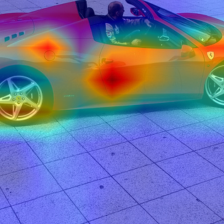

# 🚗 TwinCar: Fine-Grained Car Classification on Stanford Cars 196

[](https://huggingface.co/kikogazda/TwinCar-196-v2)
[](https://kikogazda-twin-car-model.hf.space)
[](LICENSE)

Fine-grained car make/model recognition—**fast, explainable, and state-of-the-art**.  
Developed as part of the Brainster Data Science Academy, 2025.

---

## Table of Contents

- [📁 Project Structure](#-project-structure)
- [📝 Overview](#-overview)
- [📦 Dataset & Preprocessing](#-dataset--preprocessing)
- [🧩 Model Architecture](#-model-architecture)
- [🔄 Training Pipeline](#-training-pipeline)
- [🧠 Explainability (Grad-CAM++)](#-explainability-grad-cam)
- [📊 Visualizations](#-visualizations)
- [📈 Metrics & Results](#-metrics--results)
- [🤗 Hugging Face & Demo](#-hugging-face--demo)
- [⬇️ Download Resources](#-download-resources)
- [⚡ Usage & Inference](#-usage--inference)

---

## 📂 Project Structure

<pre>
CarClassificationTeam3/
├── models/            # Model weights (final .pth here)
├── notebook/          # Final Jupyter pipeline
├── reports/           # All plots & evaluation assets
├── twincar/           # Source code (config, features, plots, modeling)
├── brainster.py       # Helper script
├── requirements.txt   # All dependencies
├── README.md          # You are here!
└── twin_car_testing.py
</pre>

---

## 🏁 Overview

**TwinCar** tackles fine-grained car recognition—distinguishing between 196 car makes/models, even when visual differences are subtle.

### Key Features:
- **Modern transfer learning** (ResNet50)
- Rich data augmentation
- Full metric tracking + curves
- **Explainability**: Grad-CAM++ heatmaps
- Easy reproducibility

---

## 📦 Dataset & Preprocessing

- **Dataset:** [Stanford Cars 196 (Hugging Face mirror)](https://huggingface.co/datasets/tanganke/stanford_cars)
    - 196 car classes
    - 16,185 images (train/test split)
    - Each image labeled by make/model/year
    - Metadata: `cars_meta.mat` (for human-readable mapping)

**Preprocessing:**
- Convert MATLAB annotations to CSV
- Stratified train/val split (10% validation)
- Advanced augmentations (random crop, flip, rotate, jitter, blur)
- Normalization (ImageNet stats)
- Outlier image cleanup

---

## 🏗️ Model Architecture

- **Backbone:** ResNet50 (ImageNet pre-trained; early layers frozen)
- **Classifier Head:** 2-layer MLP (`Linear → ReLU → Dropout → Linear`)
- **Optimization:** Adam (layer-wise learning rates; label smoothing)
- **Callbacks:** EarlyStopping (patience=7), ReduceLROnPlateau, WeightedRandomSampler

**Diagram:**
Input Image → [Augmentation] → ResNet50 (frozen layers 1–2)
↓
[Trainable layer3, layer4]
↓
Custom Classifier Head (2-layer MLP)
↓
196-class Softmax

---

## 🏋️ Training Pipeline

- **Epochs:** Up to 25 (with early stopping)
- **Batch Size:** 32 (class-balanced)
- **Validation:** Macro/micro metrics, confusion matrices, Top-3/Top-5 accuracy
- **Logging:** CSVs, plots (accuracy, F1, loss, precision/recall, top-k curves)
- **Artifacts:** All reports in `/reports` for full reproducibility

---

## 🧠 Explainability (Grad-CAM++)

**Grad-CAM++** visualizes which regions in an image influence the model’s decision:
- Builds trust, reveals attention on car parts (logo, lights, etc.)
- Great for debugging & transparency
- Powered by [pytorch-grad-cam](https://github.com/jacobgil/pytorch-grad-cam)

**Example:**  
  
*Heatmap = model’s “attention” on the car*

---

## 📈 Visualizations

A summary of the most important model insights, trends, and explainability results:

| Confusion Matrix | Training/Validation Curve |
|:----------------:|:-----------------------:|
|  |  |

<br/>

| Top-20 Classes by F1-score | Grad-CAM++ Heatmap Example |
|:--------------------------:|:-------------------------:|
|  |  |

<br/>

| Training/Validation Loss Curve | Validation Precision/Recall Curves | Top-3 & Top-5 Validation Accuracy |
|:-----------------------------:|:----------------------------------:|:---------------------------------:|
|  |  |  |

**All plots and results are available in the [`/reports`](./reports) folder.**

---

## 📊 Metrics & Results

| Metric                 | Value  |
|------------------------|--------|
| train_loss             | 0.979  |
| train_acc              | 0.997  |
| val_loss               | 1.722  |
| val_acc                | 0.791  |
| val_precision_macro    | 0.824  |
| val_precision_weighted | 0.826  |
| val_recall_macro       | 0.791  |
| val_recall_weighted    | 0.791  |
| val_f1_macro           | 0.785  |
| val_f1_weighted        | 0.787  |
| val_hamming            | 0.209  |
| val_cohen_kappa        | 0.790  |
| val_mcc                | 0.791  |
| val_jaccard_macro      | 0.684  |
| val_top3               | 0.909  |
| val_top5               | 0.934  |

---

## 🤗 Hugging Face & Demo

- **Model on Hugging Face:**  
  [kikogazda/TwinCar-196-v2](https://huggingface.co/kikogazda/TwinCar-196-v2)
- **Live Gradio Demo:**  
  [TwinCar-196 Gradio App](https://kikogazda-twin-car-model.hf.space)  
  [](https://kikogazda-twin-car-model.hf.space)
  [](https://huggingface.co/kikogazda/TwinCar-196-v2)

---

## ⬇️ Download Resources

- **Stanford Cars 196 Dataset:**  
  [Download from Hugging Face](https://huggingface.co/datasets/tanganke/stanford_cars)  
  [Download from Stanford (original site)](https://ai.stanford.edu/~jkrause/cars/car_dataset.html)
- **Trained Model Weights:**  
  [Download from Hugging Face (twin_car_best_model_v2.pth)](https://huggingface.co/kikogazda/TwinCar-196-v2/resolve/main/twin_car_best_model_v2.pth)
- **Class mapping/metadata:**  
  Included as `cars_meta.mat` (see instructions below to extract mapping)

## ⚡ Usage & Inference

To load the trained model and predict the class of a new car image:

```python
import torch
from torchvision import models, transforms
from PIL import Image

# Load trained model
model = models.resnet50()
model.fc = torch.nn.Linear(2048, 196)  # 196 car classes
model.load_state_dict(torch.load("models/twin_car_best_model_v2.pth", map_location='cpu'))
model.eval()

# Preprocessing
transform = transforms.Compose([
    transforms.Resize(256),
    transforms.CenterCrop(224),
    transforms.ToTensor(),
    transforms.Normalize([0.485, 0.456, 0.406], [0.229, 0.224, 0.225])
])

img = Image.open("your_image.jpg")
input_tensor = transform(img).unsqueeze(0)  # Add batch dimension

with torch.no_grad():
    logits = model(input_tensor)
    pred_class = logits.argmax(1).item()
print("Predicted class ID:", pred_class)
